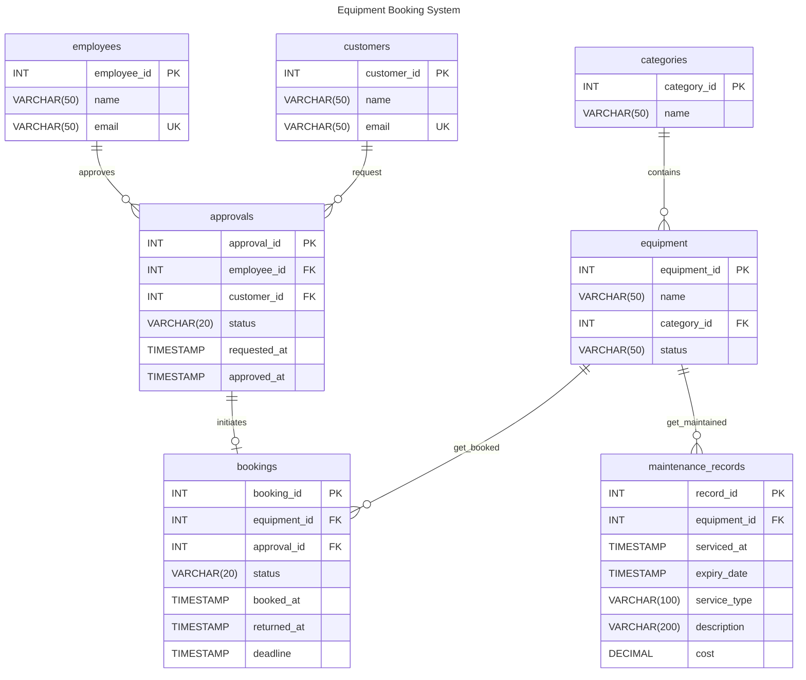

# EQUIPMENT BOOKING SYSTEM

```mermaid
---
title: Equipment Booking System
---
erDiagram
    employees{
        INT employee_id PK
        VARCHAR(50) name
        VARCHAR(50) email UK
    }
    customers{
        INT customer_id PK
        VARCHAR(50) name
        VARCHAR(50) email UK
    }
    equipment{
        INT equipment_id PK
        VARCHAR(50) name
        INT category_id FK
        VARCHAR(50) status
    }
    categories{
        INT category_id PK
        VARCHAR(50) name
    }
    bookings{
        INT booking_id PK
        INT equipment_id FK
        INT approval_id FK
        VARCHAR(20) status
        TIMESTAMP booked_at
        TIMESTAMP returned_at
        TIMESTAMP deadline
    }
    approvals{
        INT approval_id PK
        INT employee_id FK
        INT customer_id FK
        VARCHAR(20) status
        TIMESTAMP requested_at
        TIMESTAMP approved_at
    }
    maintenance_records{
        INT record_id PK
        INT equipment_id FK
        TIMESTAMP serviced_at
        TIMESTAMP expiry_date
        VARCHAR(100) service_type
        VARCHAR(200) description
        DECIMAL cost
    }
    employees ||--o{approvals : approves
    customers  ||--o{approvals : request
    approvals ||--o|bookings: initiates
    categories ||--o{equipment : contains
    equipment ||--o{bookings : get_booked
    equipment ||--o{maintenance_records : get_maintained


```
