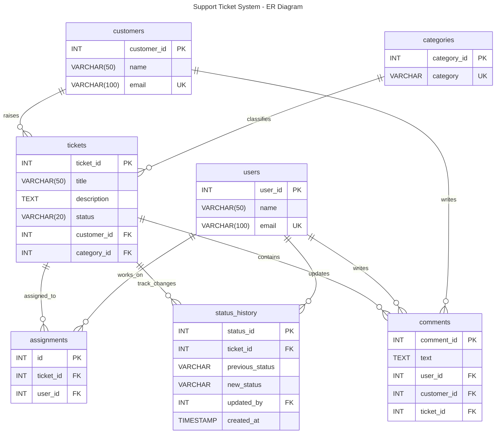

```mermaid
---
title: "Support Ticket System - ER Diagram"
---
erDiagram
    users{
        INT user_id PK
        VARCHAR(50) name
        VARCHAR(100) email UK
    }
    customers{
        INT customer_id PK
        VARCHAR(50) name
        VARCHAR(100) email UK
    }
    categories{
        INT category_id PK
        VARCHAR category UK

    }
    comments{
        INT comment_id PK
        TEXT text
        INT user_id FK
        INT customer_id FK
        INT ticket_id FK
    }
    assignments{
        INT id PK
        INT ticket_id FK
        INT user_id FK
    }
    status_history{
        INT status_id PK
        INT ticket_id FK
        VARCHAR previous_status
        VARCHAR new_status
        INT updated_by FK
        TIMESTAMP created_at
    }
    tickets{
        INT ticket_id PK
        VARCHAR(50) title
        TEXT description
        VARCHAR(20) status
        INT customer_id FK
        INT category_id FK
    }

    customers||--o{ tickets : "raises"
    tickets||--o{assignments : "assigned_to"
    users||--o{assignments :"works_on"
    categories||--o{ tickets : "classifies"
    tickets||--o{status_history : "track_changes"
    users||--o{status_history :"updates"
    tickets||--o{comments :"contains"
    users||--o{comments :"writes"
    customers||--o{comments : "writes"


```
